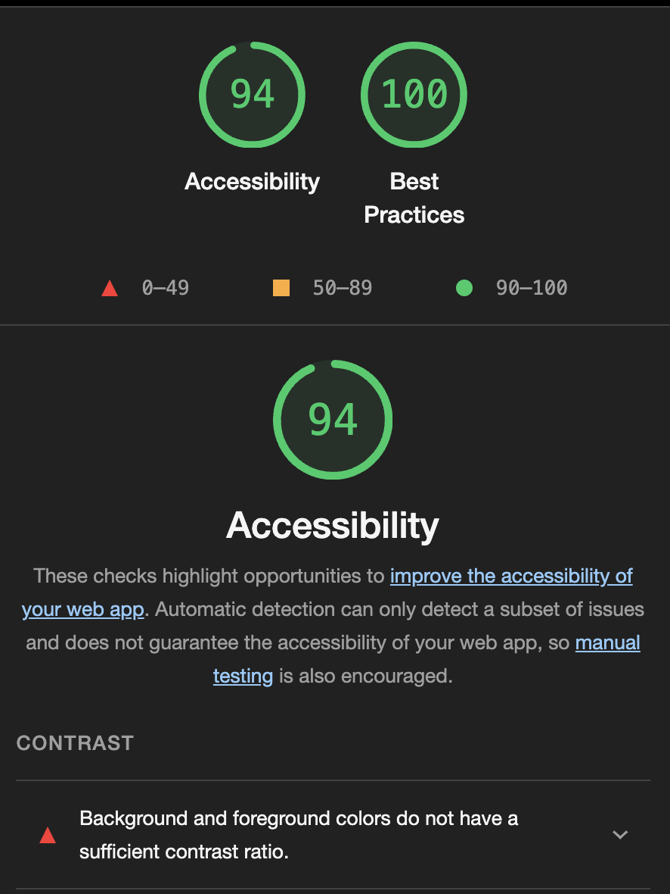

# User Management Page

## Functionality

- **Filter/Search**: A user can search and filter through the list by name by entering a name in the search bar.
- **Add User**: A user can add another user to the list. This user will be added to the list in alphabetical order and not just at the end of the list. On clicking the icon a modal pops up which can be dismissed without adding a user.
- **Delete User**: Each card has a "Bin" icon which can be clicked to remove the card from the list.
- **Pagination**: On desktop the list is paginated and displayed in chunks of at least 8 cards. This would be useful if all the data was not loaded into memory and then processed but I thought it would be a good way to break down the data.
- **Progressive Disclosure**: On mobile, data is displayed in chunks of four and a "Show more" button can be clicked to reveal more cards. If you have gone through a few pages on Desktop then switching to a mobile will reset the list to show the first four entries.
- **Sorting**: The list is sorted in ascending order by default. I have added a button which changes the icon within it to depict the sort order as well as toggle the sort order on clicking the button.

## Convention & Best practices

- **Hooks**: I have added a few custom hooks and abstracted logic out of the main Users component to improve readability and modularise the code.
- **Components**: Buttons, User details cards and modal have been made into their own reusable component. The modal is not reused anywhere else but it keeps the parent component tidy.
- **Context**: State management not required for such a small app but beats prop drilling and I did end up using it.

## Styling

- **Buttons**: Hover effects
- **Responsiveness**: Desktop and mobile have separate styling.
- **Icons**: React icons
- **Alignment/Spacing**: There is plenty of space between the different components. Mobile/Desktop buttons are large enough to click. I think best practice is a minimum of 42px on mobile.
- **Responsive**: Desktop and mobile have separate styling.

## Accessibility

I've run a lighthouse report which gave pretty good scores except for the contrast of the green pagination buttons.

## Testing

I tried to add some basic tests but ran in to some trouble because I couldn't render react components in the test correctly. I tried to fix it in the jest config and add a .babelrc file with config but couldn't manage to get it to work. I didn't want to spend too much time on this but I get some spare time, I'll try and add the right config and try to add some simple tests. _There is one working snapshot test._

## Stretch goals

- **Edit User**: Having an pen icon which when clicked allows a user to edit the details on the card.
- Role based access
